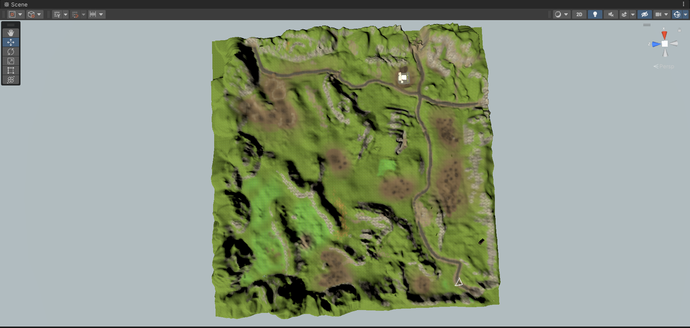

# DirDir - free Unity3d car simulator game.

## Exquisite gameplay, revolutionary.

**DirDir**

## Введение

В современном мире, когда компьютеры есть практически у каждого, и возможность играть в компьютерные игры перестала быть привилегией, различных игр существует очень много. Связано это с тем, что их разработка, как и доступ к ним, значительно упрощена с появлением общедоступных сред для разработки (проще говоря, движков) таких как Unity – который и был использован при реализации данного проекта.
 
## План работы

Для реализации любого проекта нужен план. Мы составили свой:
1. Выбор идеи и жанра будущей игры, определение целей;
2. Выбор технологий;
3. Распределение ролей;
4. Поиск моделей для объектов, текстур и т.д.;
5. Создание карты;
6. Разработка;
7. Тесты.
 
## Ход работы

1. Выбор идеи и жанра будущей игры, определение целей.
Для начала необходимо было определиться с темой работы и её жанром. Проведя анализ игровой индустрии, мы остановились на симуляторе езды по бездорожью с квестами. Довольно популярным примером проекта этого жанра является серия Spintires.
Были поставлены следующие цели:
* Создание карты;
* Поиск и создание, а затем внедрение моделей;
* Добавление объектам физических свойств;
* Проработка квестовой системы.

Рисунок 1. Игра из серии Spintires.

## Выбор технологий
Следующей задачей был выбор технологий, которые будут использоваться в нашем проекте. Для начала необходимо было выбрать движок. Изучив вопрос, мы остановились на Unity из-за простоты, а также, по причине наличия у членов команды опыта работы с ним. В качестве языка программирования был выбран C# по той же причине. В качестве редактора кода была выбрана IDE Visual Studio, так как она поддерживает многие аспекты разработки программного обеспечения и отладки.

## Распределение ролей.
Михаил: основная часть скриптов, моделирование ландшафта;
Армен: поиск моделей, создание моделей, поиск звуков;
Георгий: поиск моделей, тестирование, поиск звуков;
Общая часть – работа в Unity.

## Поиск моделей для объектов, текстур и т.д.
Перед нами возник вопрос, откуда брать модели и звуки для игры. Изучив варианты, мы приняли решение использовать открытые источники в интернете и Unity Asset Store. Основная проблема состояла в том, что не все модели корректно импортировались в Unity. Для решения этого вопроса было опробовано несколько различных версий Unity, однако, это не всегда приводило к должному результату, что повлекло за собой значительное сужение спектра выбора моделей.

Рисунок 2. Импорт модели из Unity Asset Store.

## Создание карты.
Для создания карты обычно создаётся плоскость, а затем появляется возможность изменять рельеф при помощи внутренних инструментов, представленных в среде разработки. Затем накладывается текстура. После этого на неё добавляются объекты (различные домики, трава, деревья и др.). Затем производится добавление текстуры неба (Skybox).

Рисунок 3. Создание карты.

Рисунок 4. Результат.

## Разработка.

Первое, что мы сделали – начали добавлять объекты (модели) на карту:

Рисунок 5. Добавление объектов на карте.

Именно на данном этапе мы столкнулись с вышеописанной проблемой – неправильной отрисовкой некоторых моделей.
 

Рисунок 6. Неправильная отрисовка объектов.

Решение проблемы было найдено – импорт моделей с помощью плагина FBX Exporter.

Рисунок 7. FBX Exporter.

Для разработки физики движущегося объекта был создан ее упрощенный прототип:

Рисунок 8. Разработка физики объекта, которым будет управлять игрок.

После этого мы приступили к созданию квестовой системы. Она достаточно простая, каждый квест работает следующим образом: сначала необходимо получить задание, которое состоит в том, чтобы отвезти груз в заданную точку, а после – получить награду.

Рисунок 9. Получение квеста.

## Тестирование.

В ходе тестирования было выявлено множество различных багов, большинство из которых удалось устранить. Вот основные примеры:

Рисунок 10. Езда по крутым склонам без колёс.

Рисунок 11. Если у земли задана неправильная формула гравитации.
 
## Заключение

В ходе работы над данным проектом была разработана игра с использованием Unity: выполнен поиск и разработка некоторых моделей, отрисовка карты, настройка физики объектов, проработана система квестов, отлажена анимация движения транспортного средства, которым должен управлять игрок. Таким образом, были получены навыки в сфере компьютерной графики, а основные цели, поставленные перед началом разработки были достигнуты.

## Приложение

